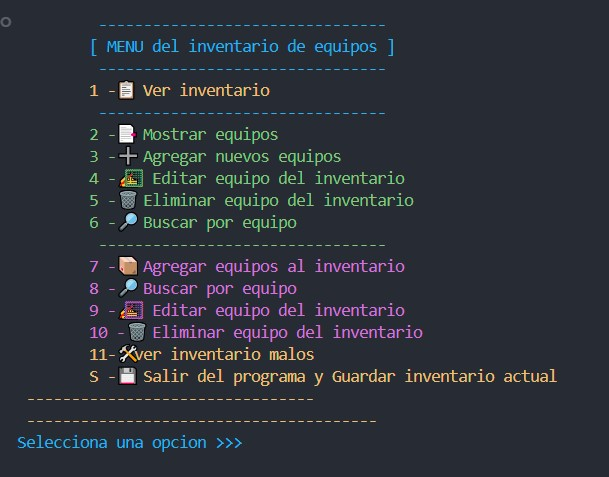

# 📌 Mini Proyectos JavaScript

## Descripción

> Este proyecto es una aplicación de consola realizado con python que permite a los usuarios observar distintas opciones de un menu.
> Para administrar el inventario de la facultad de tecnologia.
> Enfocado al mantenimiento y reportes(basico).

---

### Contenido adicional:

- ✅ Funcionalidades principales
    - Menu interactivo.
    - CRUD de categorias mediante Arrays.
    - CRUD de inventario mediante Matrices
    - Reportes exportados en .text, de todo el inventario o solo los dañados equipos.
- 🛠️ Tecnologías usadas
    - python.
---
